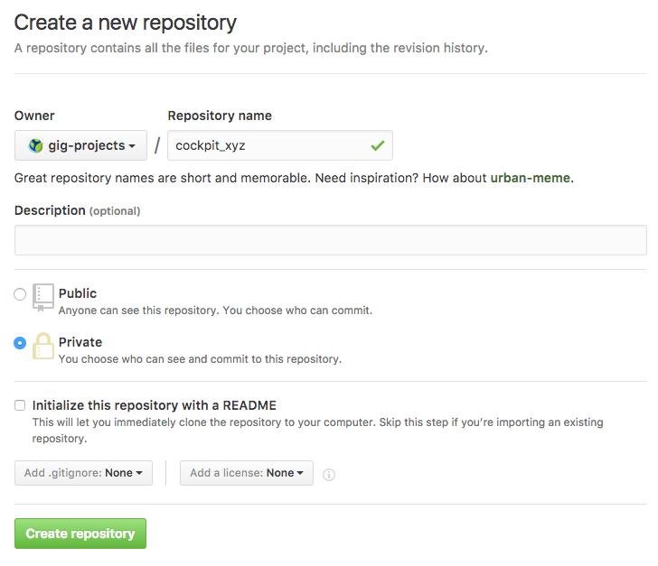

## Installation using an AYS Blueprint

Below we discuss 6 steps:

- **Step 1**: [Preparation](#prep)
- **Step 2**: [Create an AYS service repository](#create-repo)
- **Step 3**: [Create the blueprint for deploying your Cockpit](#create-blueprint)
- **Step 4**: [Execute the blueprint](#execute-blueprint)
- **Step 5**: [Run the install actions](#run-actions)
- **Step 6**: [Verify the installation](#verify-installation)


<a id="prep"></a>
### Step 1: Preparation

Go through the preparation steps as documented [here](/installation/prep/prep.md).

Additionally you will need the private and public key of your DNS server.


<a id="create-repo"></a>
### Step 2: Create an AYS service repository for your Cockpit

First create your Git repository on your Git server, or on GitHub:



Then create an AYS service repository on your machine using the `ays create_repo` command, specifying your local repository directory with `{/path/to/my/repo}` and the repository on the Git server with `{account}/cockpit_{cockpit-name}`:

```
sudo ays create_repo -p {/path/to/my/repo} -g git@github.com:{account}/cockpit_{cockpit-name}.git
```

Or alternatively, you can also do this manually:

```
mkdir -p {/path/to/my/repo}/blueprints
cd {/path/to/my/repo}
touch .ays
git initays
vim {/path/t
   o/my/repo}/.git/config
```

Add following configuration:

```
[remote "origin"]
        url = git@github.com:{account}/cockpit_{cockpit-name}.git
        fetch = +refs/heads/*:refs/remotes/origin/*
```

Make sure your Git `user.name` and `user.email` are set:

```
git config --global user.name "{your-full-name}"
git config --global user.email "{your-email-address}"
```

If you're not logged in as root, you will need to reset ownership of the current directory and all subdirectories (recursively) to the currently logged in user, in this case for `cloudscalers`:

```
cd {/path/to/my/repo}
sudo chown -R cloudscalers.cloudscalers .
```

Do your first commit:

```
git add .
git commit -m "first commit"
```

Push your changes to the Git server, and since this is your first push you need to specify the up-stream branch you want to push to::

```
git push -u origin master
```

Or alternatively use:

```
git push --set-upstream origin master
```

This will add the following entry to your `.git/config`:

```
[branch "master"]
	remote = origin
	merge = refs/heads/master
```

> Note: When you push to a remote and you use the `--set-upstream` flag Git sets the branch you are pushing to as the remote tracking branch of the branch you are pushing. Adding a remote tracking branch means that Git then knows what you want to do when you git fetch, git pull or git push in future. It assumes that you want to keep the local branch and the remote branch it is tracking in sync and does the appropriate thing to achieve this.


<a id="create-blueprint"></a>
### Step 3: Create the blueprint for deploying your Cockpit

An example blueprint is available from the [Jumpscale/jscockpit](https://github.com/Jumpscale/jscockpit) GitHub repository. You might first need to request read access since this repository is private.

In order to copy the example blueprint to your local machine use the following commands:

```
export BRANCH="8.1.1"
curl https://raw.githubusercontent.com/Jumpscale/jscockpit/${BRANCH}/blueprint/ovc_blueprint.yaml > {/path/to/my/repo}/blueprints/cockpit_{cockpit-name}.yaml
```

Here's the blueprint:

```
# connection to the g8 where to deploy the cockpit
g8client__env:
   url: '{url}'
   login: '{login}'
   password: '{password}'
   account: '{account}'

# give user access to the vdc
uservdc__{username}:
   g8client: 'env'
   email: '{email}'
   provider: 'itsyouonline'

# create the vdc that will contain the vm of the cockpit
vdc__{vdc}:
   description: 'Production Cockpit'
   g8client: 'env'
   account: '{account}'
   location: '{location}'
   uservdc:
     - '{username}@itsyouonline'

sshkey__main:

# create the host vm
node.ovc__{vm}:
   bootdisk.size: 50
   memory: 2
   os.image: 'Ubuntu 16.04 x64'
   ports:
        - '22'
        - '80:80'
        - '443:443'
   vdc: '{vdc}'
   sshkey: 'main'

sshkey__dns:
   key.path: '{path}'

# actually install the cockpit
cockpit__{cockpit}:
   host_node: '{vm}'
   dns.sshkey: 'dns'
   domain: '{domain}'
   caddy.email: '{caddy-email}'
   flist: 'https://stor.jumpscale.org/stor2/flist/aysbuild/jumpscale.flist'
   oauth.organization: '{organization}'
   oauth.client_id: '{client-id}'
   oauth.client_secret: '{client-secret}'
   oauth.jwt_key: |
       -----BEGIN PUBLIC KEY-----
       MHYwEAYHKoZIzj0CAQYFK4EEACIDYgAES5X8XrfKdx9gYayFITc89wad4usrk0n2
       7MjiGYvqalizeSWTHEpnd7oea9IQ8T5oJjMVH5cc0H5tFSKilFFeh//wngxIyny6
       6+Vq5t5B0V0Ehy01+2ceEon2Y0XDkIKv
       -----END PUBLIC KEY-----

actions:
    - action: 'install'
```

Following values need to provided:

- **{url}**: address of the G8 environment where the Cockpit needs to be installed
- **{login}**: username of the user that will be used to install the Cockpit on the targeted G8 environment
- **{password}**: password of the user on the targeted G8 environment
- **{account}**: name of the account on the targeted G8 environment that will used to install the Cockpit; make sure that the specified user has admin access to this account
- **{username}**: ItsYou.online username that will be granted access to the virtual datacenter (VDC) that will be created for the Cockpit
- **{email}**: verified e-mail address of the user as known at ItsYou.online
- **{vdc}**: case sensitive name of the VDC that will be created for the Cockpit; no spaces are allowed
- **{location}**: name of the location in the targeted G8 environment where the Cockpit needs to be installed
- **{vm}**: case sensitive name of the virtual machine that will be created for the Cockpit; no spaces are allowed
- **{path}**: path to the private SSH key of the DNS server, enabling AYS to create a DNS entry for your Cockpit, e.g. `'/root/.ssh/dns_rsa'`
- **{cockpit}**: name of your Cockpit
- **{domain}**: fully qualified domain name (FQDN) for your Cockpit, e.g. `mycockpit.aydo2.com`
  - If you don't use the auto DNS deployment then make sure manually that your DNS name resolves to the Cockpit IP address
- **{caddy-email}**: email address to which the [Caddy](https://caddyserver.com/) server will send notifications when the HTTPS certificate of the Cockpit is about to expire
  - Caddy is supposed to renew them automatically, but it's always good to double check that it actually happened
- **{organization}**: name of the organization as set in ItsYou.online, to which a Cockpit user needs be member or owner; can be the same organization as specified with `{client-id}`, but can also be different
- **{client-id}**: name of the organization as set in ItsYou.online, typically the company/organization for which you are setting up the Cockpit; in order for a user to be able to use the Cockpit he doesn't need be owner or member of this organization
- **{client-secret}**: the client secret that goes with the `{client-id}` of the organization for which the Cockpit is setup

> Note: the JWT value specified for **oauth.jwt_key** is the ItsYou.online public key for JWT signing; see https://github.com/itsyouonline/identityserver/blob/master/docs/oauth2/jwt.md for more details.

> Note: the value for **host_node** {vm} needs to point to a service of role `node`, such as `node.ovc`. It can also be `node.docker` if you want the Cockpit to be installed in a Docker container.


<a id="execute-blueprint"></a>
### Step 4: Execute the blueprint

```
cd {/path/to/my/repo}
sudo ays blueprint
```

You might get an `ImportError: No module named 'pytoml'` error, in that case simply execute:

```
pip install pytoml
```


<a id="run-actions"></a>
### Step 5: Run the install actions

```
sudo ays run
```


<a id="verify-installation"></a>
### Step 6: Verify the installation

On the virtual machine running the Cockpit you can verify the configuration of the **Cockpit API** and the **Cockpit Portal**:

- Cockpit API:

  ```
  vi /optvar/cfg/cockpit_api/config.toml
  ```

- Portal:

  ```
  vi /optvar/cfg/portals/main/config.hrd
  ```

If you need to stop and/or restart any of the Cockpit components, check the tmux sessions:

```
tmux list-sessions
```
