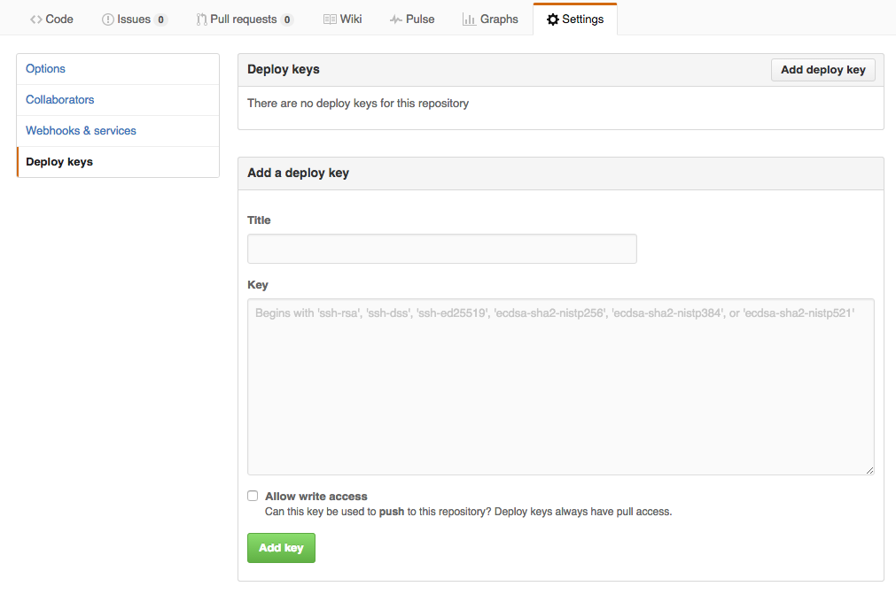

## Installation of a Cockpit

There are two ways to install a new **Cockpit**:

- [Installing using Telegram](Using-Telegram/using-Telegram.md) (recommended)
- [Installing using an AYS Blueprint](Using-Blueprint/using-blueprint.md)

Both options requires some pre-installation preparation:

- [Configure Itsyou.online](prep/Itsyou.online/Itsyou-online.md)
- [Create a Telegram chatbot and get an HTTP API token for it](prep/Telegram/Telegram.md)
- [Create GitHub repository](prep/GitHub/GitHub.md)

### Allow the Cockpit to push to your Github repository

The last thing you need to do is configure your Cockpit to create a deploy key on your GitHub repository where all AYS service instances information will be saved.

To do that:
- Go to the **Settings** page of the GitHub repository specified during installation
- Click **Add deploy key** in the **Deploy keys** tab
- Copy the content of the public key that you can find in the portal information page

