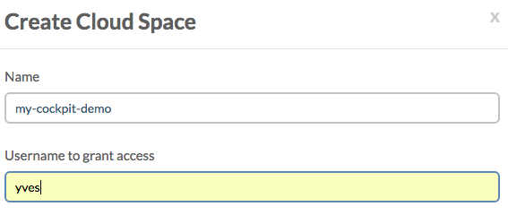
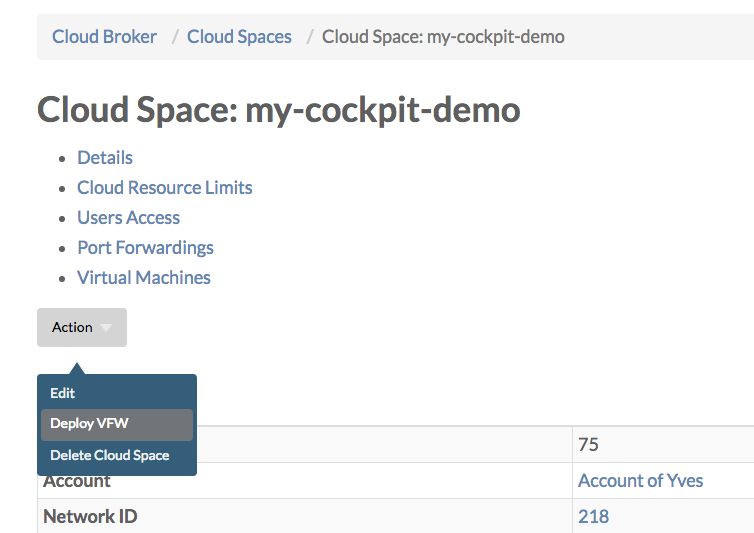
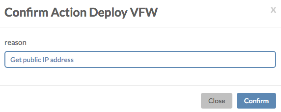

## Create a Cloud Space

This is optional, and the below steps require access to the **Cloud Broker Portal**. In case you don't have access to the **Cloud Broker Portal**, simply skip this step, and allow the installation (through AYS or Telegram) create a new cloud space or use an existing cloud space. 

The Cockpit will run in a virtual machine that is part of a cloud space. This cloud space can be an existing cloud space, or a new cloud space will be created.

Creating the cloud space upfront gives you the advantage that you can assert that your cloud space gets a public IP address before continuing with the installation.

> When creating a new cloud space through the it is highly recommended not to use any capital letters

- Creating a new cloud space with the **Cloud Broker Portal**:

- Deploy the virtual firewall in order to get a free public address assigned to the cloud space:

- Specify a reason why you want to deploy the virtual firewall and click **Confirm**:

You will specify the name of cloud space when asked for **the name of the Cockpit** during the installation, which is a little confusing since the name you specify will both be used as the name of the Cockpit **and** the name of the cloud space where the virtual machine hosting the Cockpit will be created during the installation.

> As noted above it is important not to use any capitals in the name of the cloud space, since you might otherwise end-up with the creation another cloud space with the exact same name, but then all in lower cases.