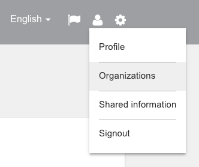
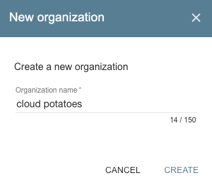
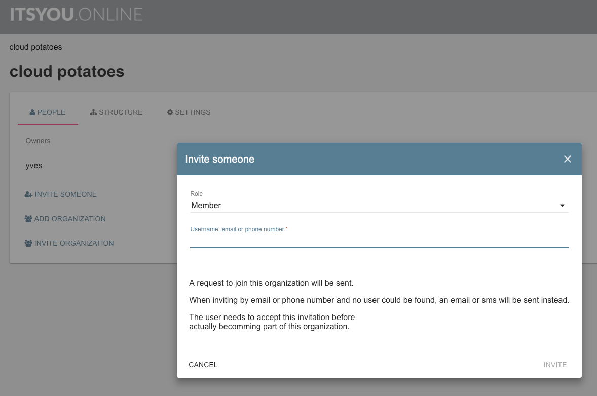
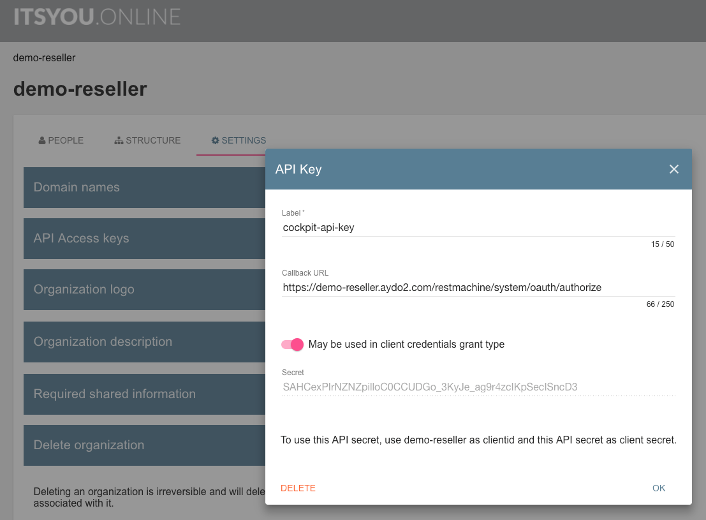

## Configure ItsYou.online

This is how a **Cockpit** depends on ItsYou.online:

- Cockpit users are authenticated against ItsYou.online, they need to be member of a specific ItsYou.online organization
- Cockpits are always deployed for specific organizations on behalf of which they operate, these organizations also need to be registered at ItsYou.online

For each of these purposes you can setup a distinct/independent organization, or you can opt to use only one organization for both.

### Setup an ItsYou.online organization for authenticating Cockpit Users

Let's start by creating a new organization at [ItsYou.online](http://www.itsyou.online) for meeting the first purpose:

- Once logged in select **Organizations** from the dropdown menu that appears when clicking the pawn icon in the right top corner:

  

- Click the **+ CREATE NEW** in order to create a new organization:

  

- Here I create a new organization **cloud potatoes**:

  

> The name of this organization is the value for `oauth.organization` (`{organization}`) that is required in the AYS blueprint for deploying a new Cockpit. The Cockpit will use this value to verify that the Cockpit user is either member or owner. This happens as part of the  **Authorization Code Flow**, as discussed in the [ItsYou.online documentation](https://gig.gitbooks.io/itsyouonline/content/oauth2/oauth2.html).

- And finally, make sure to add the Cockpit users to this organization:

  

> In case you are using a distinct organization for representing the Cockpit, as discussed next, you don't need to create an API access key (client secret) for this organization.

### Setup an ItsYou.online organization for representing the Cockpit

In order for the Cockpit to authenticate users, and check wether they are member of the ItsYou.online organization discussed here above, you also need to setup another organization on behalf of which the Cockpit operates. This can be the same organization or another one.

For this organization you need to create an API access key (client secret). The Cockpit will use this client secret to authenticate itself against ItsYou.online, allowing the Cockpit to operate on behalf of the organization.

Once the organization is created, go to the **Settings** tab of the new organization, and click **+ADD** in the **API Access Keys** section, here for the "demo-reseller" organization:

In this dialog:

- **Label** can be any value, typically identifying the purpose of the key
- **Callback URL** is the address to which users will be redirected after having authenticated, for a Cockpit this is always `{FQDN}/restmachine/system/oauth/authorize`
- **May be used in client credentials grant type** allows the Cockpit to interact with the ItsYou.online using the **Client Credential Flow**, as discussed in the [ItsYou.online documentation](https://gig.gitbooks.io/itsyouonline/content/oauth2/oauth2.html)
- **Secret** is created by clicking the **Create** button

The blueprint for creating a Cockpit takes the **name of organization** (not the API Key label!) as the value for `oauth.client_id` (`{client-id}`) and the **secret** as the value for `oauth.client_secret` (`{client-secret}`).
