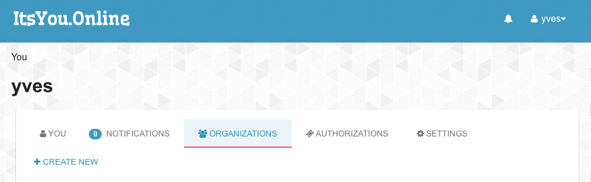
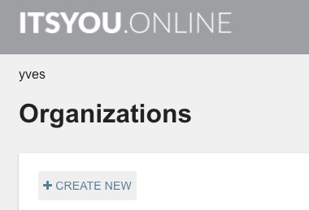

## Configure ItsYou.online

The Cockpit uses ItsYou.online to authenticate users.

A Cockpit is always deployed for a specific organization that needs to be registered at ItsYou.online.

Let's start by creating a new organization at ItsYou.online.

- Once logged in goto the **Organizations** tab: 

- Click **+ CREATE NEW**:

As part of the Cockpit installation process through Telegram you will be requested to authenticate on ItsYou.online and authorize the chatbot to check that you are member/owner of the organization for which the Cockpit is setup.

Also later when using the Cockpit Portal, it will be verified that the user logging in to the Cockpit Portal is member of this organization.