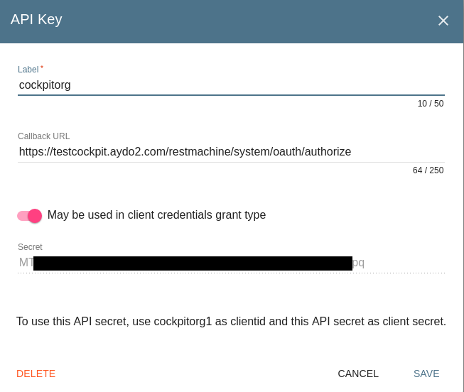

<<<<<<< HEAD
# How to Configure ItsYou.online Integration

## Enable ItsYou.online integration

First make sure that you setup the required ItsYou.online organizations as documented in [Setup the ItsYou.online Organizations](Itsyou.online).

Update `/optvar/cfg/portals/main/config.hrd` as follows:

- Set `param.cfg.production           = True`
- Set `param.cfg.force_oauth_instance = 'ItsYou.online'`
- Change `param.cfg.client_id         = '{client-id}'`
- Change `param.cfg.client_secret     = '{client-secret}'`
- Set `param.cfg.redirect_url         = 'https://{cockpit-base-address}/restmachine/system/oauth/authorize'`
- Set `param.cfg.organization         = '{organization}'`

Update `/optvar/cfg/cockpit_api/config.toml` as follows:

- Remove `production = False` or set to `True`
- Set `organization = "{organization}"`
- Set `redirect_uri = "https://cockpit-base-address/api/oauth/callback"`
- Set `client_secret = "{client-secret}"`
- Set `client_id = "{organization_id}"`
- Set `jwt_key = "{JWT-for-ItsYou.online}"`


Values:

- **{client-id}**: name of the organization as set in ItsYou.online, typically the company/organization for which you are setting up the Cockpit; in order for a user to be able to use the Cockpit he doesn't need be owner or member of this organization
- **{client-secret}**: the client secret that goes with the `{client-id}` of the organization for which the Cockpit is setup
- **{cockpit-base-address}**: the IP address of domain name (FQDN) on which the Cockpit is active, e.g. `mycockpit.aydo2.com`
- **{organization}**: name of the organization as set in ItsYou.online, to which a Cockpit user needs be member or owner; can be the same organization as specified with `{client-id}`, but can also be different
- **{JWT-for-ItsYou.online}**: set it to the following string:
  ```
  -----BEGIN PUBLIC KEY-----
  MHYwEAYHKoZIzj0CAQYFK4EEACIDYgAES5X8XrfKdx9gYayFITc89wad4usrk0n2
  7MjiGYvqalizeSWTHEpnd7oea9IQ8T5oJjMVH5cc0H5tFSKilFFeh//wngxIyny6
  6+Vq5t5B0V0Ehy01+2ceEon2Y0XDkIKv
  -----END PUBLIC KEY-----
  ```

## Diable ItsYou.online integration


Update `/optvar/cfg/portals/main/config.hrd` as follows:

- Set `param.cfg.production           = False`

Update `/optvar/cfg/cockpit_api/config.toml` as follows:

- Set `production = False`


systemctl restart portal
=======
# How to configure cockpit to work with/without itsyou.online
- In this scenario you will need an organization and a client_id
- The organization and client_id are the organization name that you created in itsyou.online
- the client_secret, you can get it by creating an `API ACCESS Key` in ityou.online under organization `settings` and configure the callbackurl like the following


## Change cockpit to use itsyou.online if it is in dev mode

### - Open /optvar/cfg/portals/main/config.hrd
- set `param.cfg.production           = True`
- set `param.cfg.force_oauth_instance = 'itsyou.online'`
- change `param.cfg.client_id            = 'cockpitorg1'` to your Organinzation ID that is in itsyou.online
- change `param.cfg.client_secret        = 'MT*************************************pq'` to the equivalent one in itsyou.online
- set `param.cfg.redirect_url         = 'https://testcockpit.aydo2.com/restmachine/system/oauth/authorize'` to the correct cockpit url or use IP
- set `param.cfg.organization         = 'cockpitorg1'` set to organization ID

### - Open /optvar/cfg/cockpit_api/config.toml
- if you have `production = False` remove it or set to `True`
- set `organization = "cockpitorg1"` to be the organization you created in itsyou.online
- set `redirect_uri = "https://testcockpit.aydo2.com/api/oauth/callback"`
- set `client_secret = "<client_secret_from_itsyou.online>"`
- set `client_id = "<organization_id>"`
- set `jwt_key = "<JWT_for_itsyou.online>"`

## Set cockpit to `NOT` use itsyou.online
### Open /optvar/cfg/portals/main/config.hrd
- set `param.cfg.production           = False`

### Open /optvar/cfg/cockpit_api/config.toml
- set `production = False`
>>>>>>> 8c06d26dae375acc404efa5676f9a1a40e2114f8
