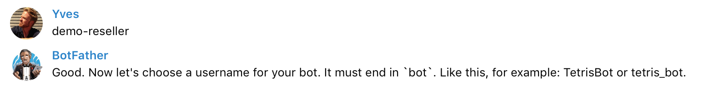
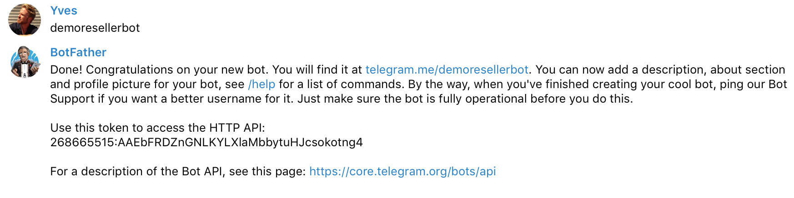
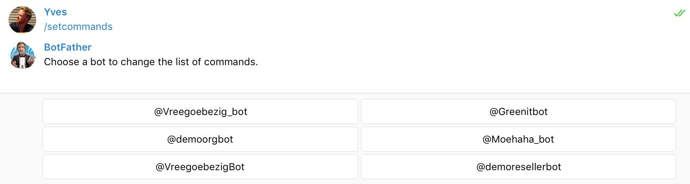
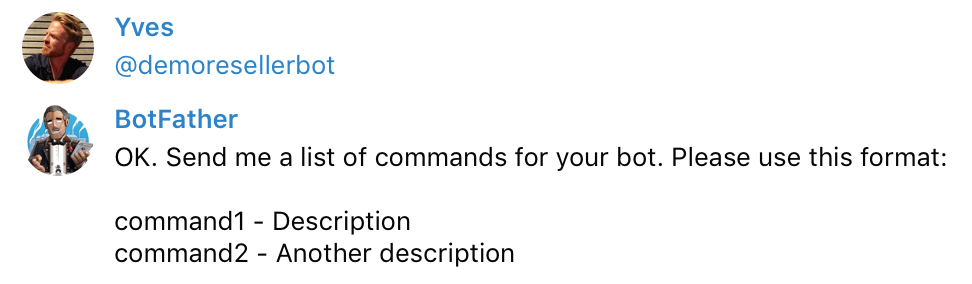

## Create a Telegram Chatbot

As part of the Cockpit installation you'll be asked to specify an **API token from Telegram**.

This is token that the Cockpit Chatbot module uses to communicate with the Telegram servers for controlling the chatbot conversations.

In order to get this API token, you need to create the create a new chatbot, this is done by talking with the `@botfather` on Telegram:

- Connect to Telegram and talk to `@botfather`
- Execute the command `/newbot`:

- Choose a name for your chatbot:

- Choose a username for your chatbot, ending with `bot`:

As result you get the API token that will need to supply as part of the installation. 

- You also will want to add command descriptions to chatbot, this by using the `/setcommands` command:

- Select the bot for which you want to set the commands:

- Paste following lines:

    start - Start discussion with the bot
    repo - Manage your AYS repositories
    blueprint - Manage your blueprints project
    service - Perform actions on your service instances
    help - Show you what I can do

- You'll folowing result:

