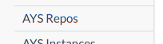
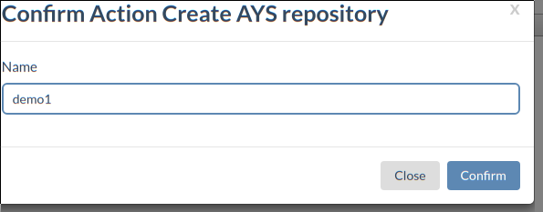
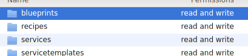
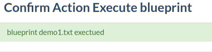
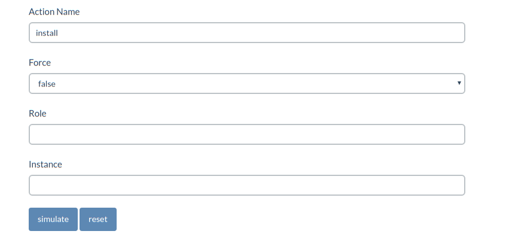
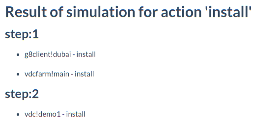
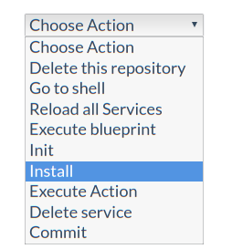
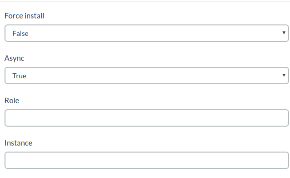

# Getting Started

This example will guide you through all the steps required to deploy a blueprint using the Cockpit Portal.  
The goal of this exercise will be to create a new VDC on one G8.

**Creation of the AYS Repository**:  
Before you can execute a blueprint you need to create an AYS repository. This repository will contains your blueprints and the services instance after the execution of the blueprint.  
To create a new repository click on the `AYS Repos` link in the menu. 


This page displays all your repositories. On the right side of the page there is an drop-down menu. Chosse `Create AYS repository`. A Popup form will appear, choose the name of your repository then click confirm.


You can now see your new repository in the list of repo. Click on your newly created repository.

**Create the blueprint**:  
Now that you have your repository ready, the next step is too create the blueprint that will create your VDC.
Here is the blueprint we are going to use:  
```yaml
g8client__dubai:
  g8.url: 'du-conv-3.demo.greenitglobe.com'
  g8.login: 'demo1'
  g8.password: '*****'
  g8.account: 'demo1'

vdc__demo1:
  g8.client.name: ' dubai'
  maxMemoryCapacity: 2
  maxVDiskCapacity: 10
  maxCPUCapacity: 2
  maxNASCapacity: 20
  maxArchiveCapacity: 20
  maxNetworkOptTransfer: 5
  maxNetworkPeerTransfer: 15
  maxNumPublicIP: 1
```

To create this new blueprint click on the `explorer` link in the repository page. This will send you on the explorer page. This page let you navigate in your repository.  
- double click the blueprint folder to enter in the folder
- click right and the select `new text file`
- right click on the newly created file, select edit file.
- An editor opens, past the content of the blueprint, then save.


**Execute the blueprint**:  
Now that the blueprint is ready we need to execute it. This step will translate the blueprint in actual service instance.  
To do that:
- go back to the Repository page.
- select `execute blueprint` in the drop-down button
- a popup will appear. leave the form empty and click confirm.
- A message will tell you that your blueprint is executed.
- 

**Make sure the service instance are created**:  
To be sure that the blueprint executed properly you can go back on the repository page and from there click the `instances` link.  
The instances page show you all the services instance in your repository. You can click the instance to have a detailed page about this specific instance.

**Simulate installation**:
Before installing the service, we want to simulate the installation and double check the service will behave as we want.  
From the repository page click the simulator link. The simulator let you preview what action will happen without actually executing them. Fill the form like shown in the next picture.



Here we want to simulate the `install` action and we don't want to filer on service role or instance. This mean all service in the repository will be installed. Click the simulate button to have show the result of the simulation.



We see that the installation will be executed in two steps. First the `g8client` and `vdcfarm` service will be installed. then the `vdc`. These two steps are due to the fact that the `vdc` depend on the `g8client` and `vdcfarm`.

**Installing the services**:  
Now that we are confident in the installation steps, we can actually do the installation.
To do that select the `install` option from the action drop-down button.

Like before, a popup form will appear. Select the same value as in the simulation and click confirm.


A message will tell you that the installation succeed.  

**Congratulation**  
You have just deployed a new VDC from you cockpit using AtYourService.

You can go have a look in the instance page to check the state of your services and see that the `install` method has now a state `OK`