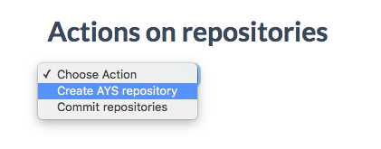
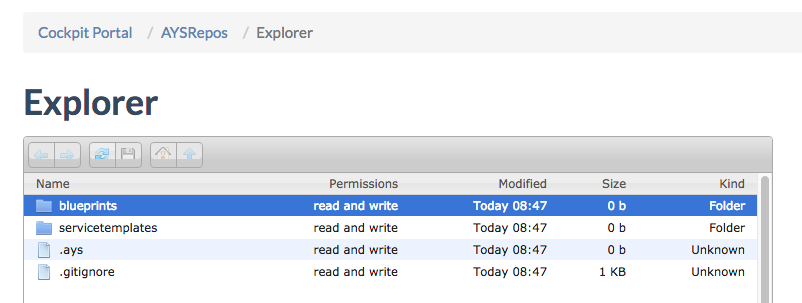
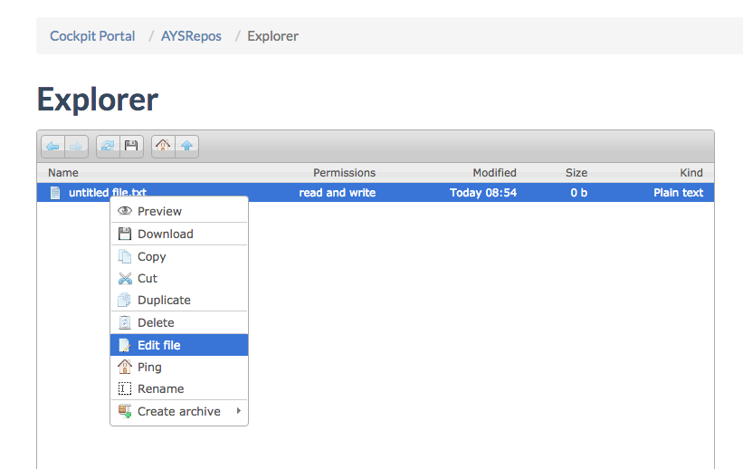
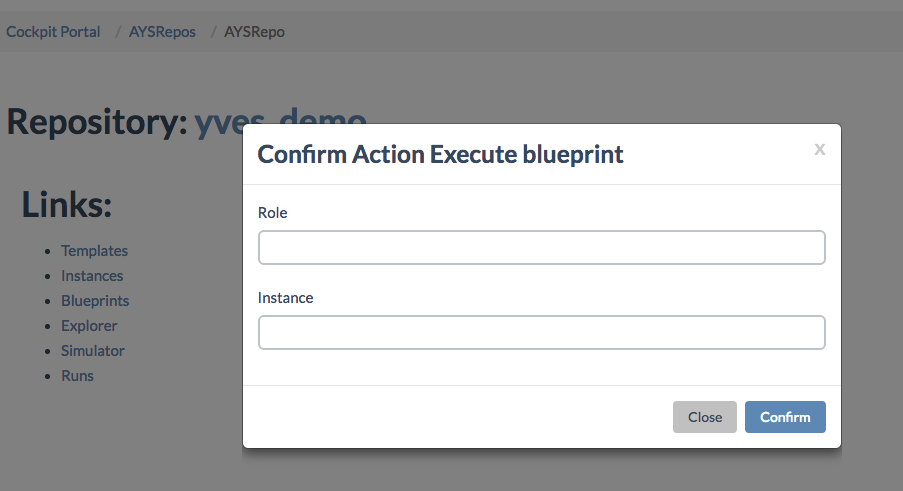
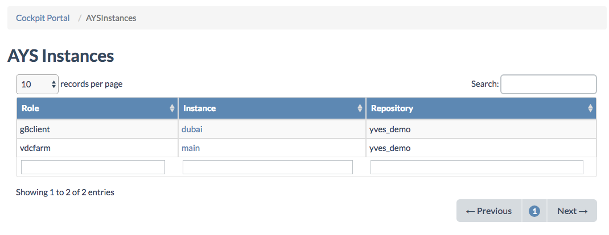
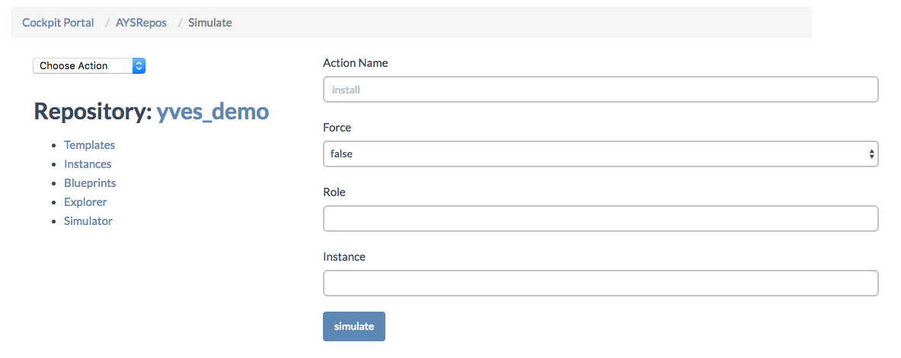
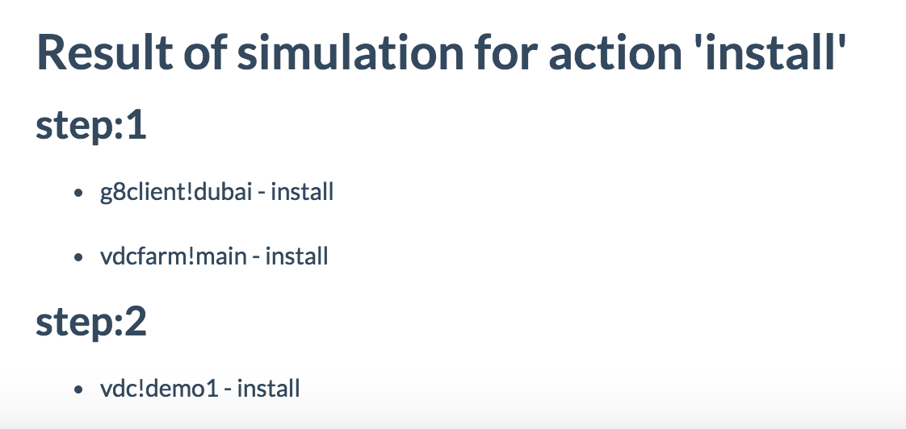

## Getting Started

This example will guide you through all the steps required to deploy a blueprint using the **Cockpit Portal**. The goal of this exercise will be to create a new virtual datacenter (VDC) on a G8 node.

This will happen in 6 steps:
- Step 1: Create a new AYS repository
- Step 2: Create a blueprint for deploying a virtual datacenter
- Step 3: Execute the blueprint, which will create the required service instances
- Step 4: Make sure the service instances are created, and ready to install (step 6)
- Step 5: Simulate the installation of the service instances as created from the blueprint
- Step 6: Install the service instances as created by executing the blueprint (step 3)


### Step 1: Creation of the AYS repository
  
Before you can execute a blueprint you need to create an AYS repository. This repository will contain your blueprints and the service instances once the blueprint got executed.
  
To create a new repository click **AYS Repos** in the left navigation menu:



This page displays all your repositories. On the right side of the page there is an drop-down menu. Choose **Create AYS repository**. A popup form will appear. Provide a name for your new repository and click **Confirm**:


You can now see your new repository in the list of repos. Click your newly created repository.


### Step 2: Create the blueprint
 
Now that you have your repository ready, the next step is to create the blueprint for creating your virtual datacenter (VDC). Here is the blueprint we are going to use:  

```yaml
g8client__dubai:
  g8.url: 'du-conv-3.demo.greenitglobe.com'
  g8.login: 'demo1'
  g8.password: '*****'
  g8.account: 'demo1'

vdc__demo1:
  g8.client.name: ' dubai'
  maxMemoryCapacity: 2
  maxVDiskCapacity: 10
  maxCPUCapacity: 2
  maxNASCapacity: 20
  maxArchiveCapacity: 20
  maxNetworkOptTransfer: 5
  maxNetworkPeerTransfer: 15
  maxNumPublicIP: 1
```

To create this new blueprint click on the **explorer** link on the repository page. This will open the explorer page where you then navigate to the directory of your new repository.



- Double click the blueprint folder
- Right click and select **New text file**
- Right click on the newly created file, select **edit file**



- An editor opens, paste the content of the blueprint, then **save**

![edit-blueprint.png]

- Rename the new bliueprint to anything you choose, no speficic extension is required:

![rename-blueprint.png]
![renamed-blueprint.png]


### Step 3: Execute the blueprint
 
Now that the blueprint is ready we need to execute it. This step will create (not install) all the necessary service instances required by the blueprint. The actual installation of these service instances happen in step 5.

To do that:

- Double-click you newly created AYS repo on the **AYS Repos** page
- Select **Execute Blueprint** from the drop-down list


- In the popup that appears, leave the form empty and click confirm



- A message will tell you that your blueprint is executed


### Step 4: Make sure the service instances are created

To be sure that the blueprint executed properly you can go back to **AYS Repos** and click the **Instances** link under your new repository.



The instances page shows you all the service instances in your newly created repository. Clicking an instance will bring you to the **Instance Details** page of that service instance.

From here you can either
- First simulate the installation of the services instances, see step 5
- Or immediately actually install the service instances, seet step 6


### Step 5: Simulate installation

Before installing the service, we want to simulate the installation in order to make sure the service will behave as we want without having to actually install the service.

From **AYS Repos** click the **Simulator** link. The simulator lets you preview what action will happen without actually executing them. Fill the form like shown in the next picture.



Here we want to simulate the `install` action and we don't want to specify a specific service role or instance. This means all services in the repository will be installed. Click the simulate button to have show the result of the simulation.



We see that the installation will be executed in two steps. First the `g8client` and `vdcfarm` service will be installed. then the `vdc`. These two steps are due to the fact that the `vdc` depends on the `g8client` and `vdcfarm`.


### Step 6: Installing the services

Now that we are confident with the installation steps, we can actually do the installation.
To do that select the **Install** from the action drop-down list.


Like before, a popup form will appear. Select the same value as in the simulation and click **Confirm**.


A message will tell you that the installation succeeded.  


## Congratulations

You have just deployed a new VDC from your **Cockpit Portal** using AtYourService.

You can go have a look in the instance page to check the state of your services and see that the `install` method has now a state `OK`.