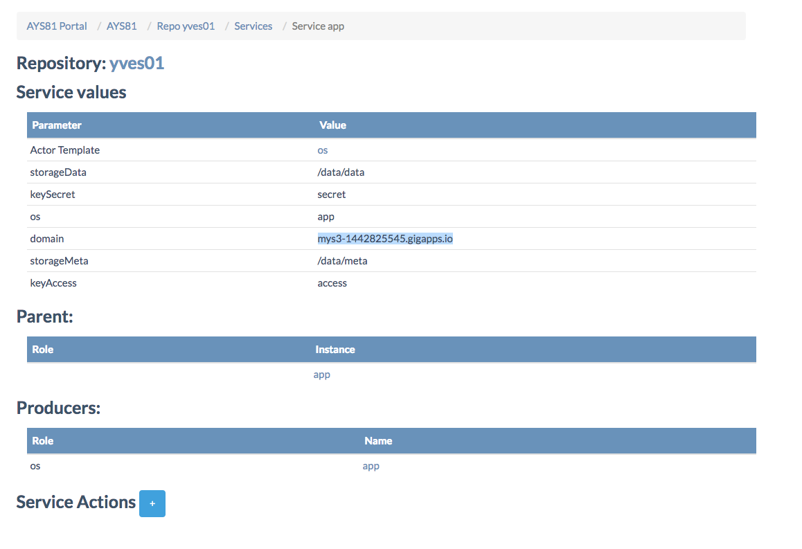

## How to create a S3 server

Here's the blueprint:

```yaml
g8client__cl:
  url: uk-g8-1.demo.greenitglobe.com
  login: cockpit
  password: cockpit12345
  account: Account of Yves

vdc__vdc4s3:
  g8client: cl
  account: Account of Yves
  location: uk-g8-1

sshkey__main:

disk.ovc__disk1:
  size: 1000

s3__s3server:
  vdc: vdc4s3
  sshkey: main
  disk:
    - 'disk1'
  hostprefix: 'mys3'
  key.access: 'access'
  key.secret: 'secret'

actions:
  - action: 'install'
```

Let's first put the blueprint in JSON file:

```
vi s3server.json
```

Copy/paste:

```json
{"name":"s3.yaml","content":"g8client__cl:\n  url: uk-g8-1.demo.greenitglobe.com\n  login: cockpit\n  password: cockpit12345\n  account: Account of Yves\n\nvdc__vdc4s3:\n  g8client: cl\n  account: Account of Yves\n  location: uk-g8-1\n\nsshkey__main:\n\ndisk.ovc__disk1:\n  size: 1000\n\ns3__s3server:\n  vdc: vdc4s3\n  sshkey: main\n  disk:\n    - 'disk1'\n  hostprefix: 'mys3'\n  key.access: 'access'\n  key.secret: 'secret'\n\nactions:\n  - action: 'install'"}
```

List all repositories:

```
curl -X GET -H "Authorization: bearer $JWT$" http://85.255.197.77:5000/ays/repository | python -m json.tool
```

Create a new repository:

```
curl -X POST -H "Authorization: bearer $JWT$" -H "Content-Type: application/json" -d '{"name":"yves01", "git_url":"git@github.com:yveskerwyn/cockpit_repo_yves.git"}' http://85.255.197.77:5000/ays/repository | python -m json.tool
```

Set the blueprint to the Cockpit:

```
curl -X POST -H "Authorization: bearer $JWT$" -H "Content-Type: application/json" -d @s3server.json http://85.255.197.77:5000/ays/repository/yves01/blueprint | python -m json.tool
```


Execute the blueprint:

```
curl -X POST -H "Authorization: bearer $JWT$" http://85.255.197.77:5000/ays/repository/yves01/blueprint/uk.yaml | python -m json.tool
```

Create a run:

```
curl -X POST -H "Authorization: bearer $JWT$" http://85.255.197.77:5000/ays/repository/yves01/aysrun | python -m json.tool
```


In the **Cockpit** go to **Services** and select the `app` service of the `scalitity` actor:



Notice the value for `domain` which you will need in the configuration of `s3cmd` here below.

The same information can be retrieved using `js`, when executed in the repository directory:

```python
In [1]: repo = j.atyourservice.get()

In [2]: scalityapp = repo.serviceGet('scality', 'app')

In [3]: scalityapp.model.data
Out[3]: <schema_f9020c5a81a2021c_capnp:Schema builder (os = "app", domain = "mys3-1442825545.gigapps.io", storageData = "/data/data", storageMeta = "/data/meta", keyAccess = "access", keySecret = "secret")>
```

Now let's test the S3 server using [s3cmd](http://s3tools.org/s3cmd-howto).

On your machine first thing to do is updating the content of `~/.s3cfg`, basically replacing everything with:

```
[default]
access_key = accessKey1
secret_key = verySecretKey1

host_base = mys3-1442825545.gigapps.io
host_bucket = mys3-1442825545.gigapps.io

signature_v2 = True
use_https = False
```

Make sure you changed to values of `host_base` and `host_bucket` to the value you got for `domain` through the **Cockpit** or executing `js`.

Once done, you can use start creating a bucket with `s3cmd mb` and use `s3cmd put` and `s3cmd put` to test the S3 server:

```
s3cmd ls
s3cmd mb s3://yves01
vi test
s3cmd put test s3://yves01
s3cmd get s3://yves01/test test2
cat test2
```
