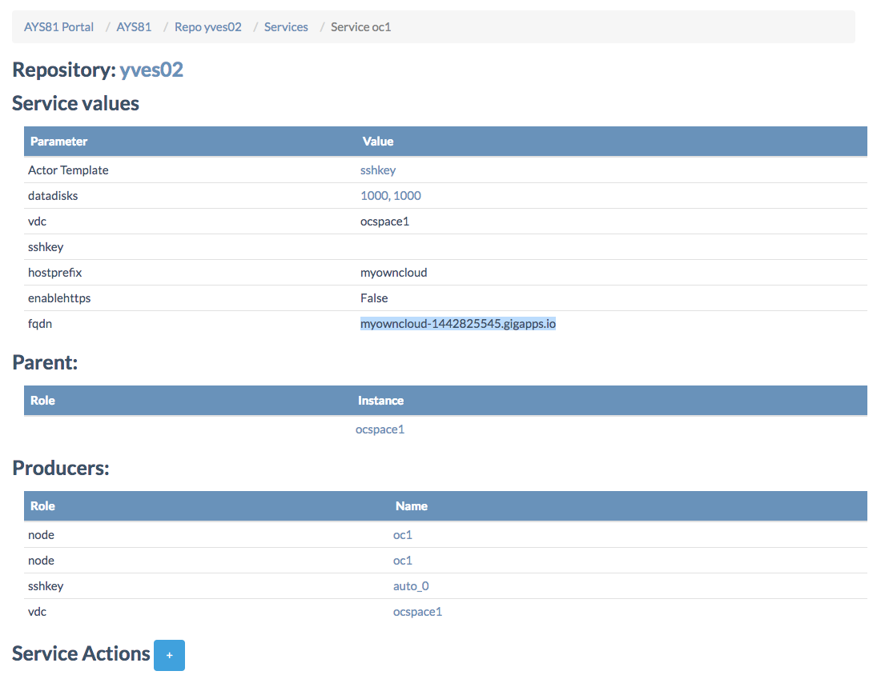
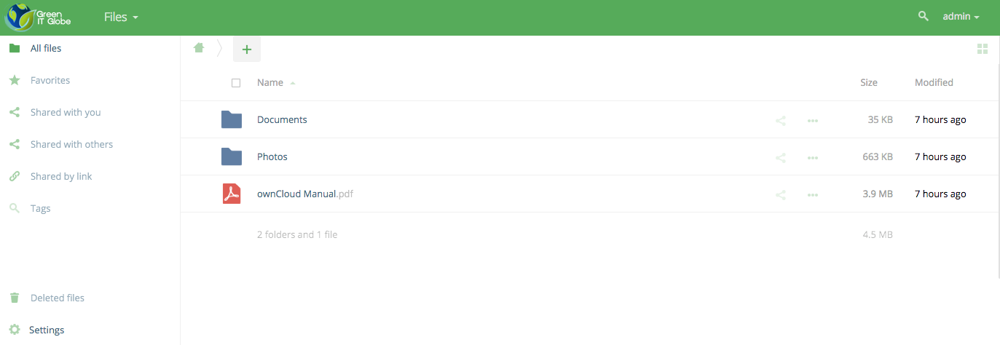

## How to create an ownCloud server

For deploying an ownCloud use the **blueowncloud** actor template, available here: https://github.com/Jumpscale/ays_jumpscale8/tree/master/templates/app/blueowncloud

Steps:

- [Review the blueprint](#review-blueprint)
- [Put blueprint in a JSON file](#json-file)
- [Create a new repository (optionally)](#create-repository)
- [Send the blueprint to the Cockpit](#send-blueprint)
- [Execute the blueprint](#execute-blueprint)
- [Create a run](#create-run)
- [Check result](#check-result)
- [Test the ownCloud server](#test-owncloud)


<a id="review-blueprint"></a>
### Review the blueprint

Here's the blueprint:
```
g8client__{environment}:
  url: '{url}'
  login: '{login}'
  password: '{password}'
  account: '{account}'

vdc__{vdc-name}:
  g8client: '{environment}'
  location: '{location}'

blueowncloud__{owncloud-name}:
  vdc: '{vdc-name}'
  datadisks:
    - 1000
    - 1000
  hostprefix: '{owncloud-prefix}'

actions:
  - action: install
```

Example:

```yaml
g8client__env1:
  url: 'uk-g8-1.demo.greenitglobe.com'
  login: 'cockpit'
  password: 'cockpit12345'
  account: 'Account of Yves'

vdc__myvdc:
  g8client: 'env1'
  location: 'uk-g8-1'

blueowncloud__myowncloud:
  vdc: 'myvdc'
  datadisks:
    - 1000
    - 1000
  hostprefix: 'myowncloud'

actions:
  - action: install
```


<a id="json-file"></a>
### Put blueprint in a JSON file

Let's first put the blueprint in JSON file:

```
vi owncloud.json
```

Copy/paste:

```json
{"name":"owncloud.yaml","content":"g8client__env1:\n  url: 'uk-g8-1.demo.greenitglobe.com'\n  login: 'cockpit'\n  password: 'cockpit12345'\n  account: 'Account of Yves'\n\nvdc__ocspace1:\n  g8client: 'env1'\n  location: 'uk-g8-1'\n\nblueowncloud__oc1:\n  vdc: 'ocspace1'\n  datadisks:\n    - 1000\n    - 1000\n  hostprefix: 'myowncloud'\n\nactions:\n  - action: 'install'"}
```

<a id="create-repository"></a>
### Create a new repository (optionally)

Create a new repository :

```
curl -X POST -H "Authorization: bearer $JWT$" -H "Content-Type: application/json" -d '{"name":"yves02", "git_url":"git@github.com:yveskerwyn/cockpit_repo_yves2.git"}' http://85.255.197.77:5000/ays/repository | python -m json.tool
```

Notice the pipe to `python -m json.tool` in order to display the returned JSON in a readable format.


<a id="send-blueprint"></a>
### Send the blueprint to the Cockpit

Sending the blueprint to the Cockpit using `curl`:

```
curl -X POST -H "Authorization: bearer $JWT$" -H "Content-Type: application/json" -d @owncloud.json http://85.255.197.77:5000/ays/repository/yves02/blueprint | python -m json.tool
```


<a id="execute-blueprint"></a>
### Execute the blueprint

Again using `curl`:

```
curl -X POST -H "Authorization: bearer $JWT$" http://85.255.197.77:5000/ays/repository/yves02/blueprint/owncloud.yaml | python -m json.tool
```

<a id="create-run"></a>
### Create a run

Using curl:

```
curl -X POST -H "Authorization: bearer $JWT$" http://85.255.197.77:5000/ays/repository/yves02/aysrun | python -m json.tool
```

### Check result

In the **Cockpit** go to **Services** and select the `oc1` service of the `blueowncloud` actor:



Notice the value for `fqdn` which is the actual URL where you can test the ownCloud server, discussed below.

This fully qualified domain name (`fqdn`) is generated using **ipdns**, a stateless DNS server, see: https://github.com/0-complexity/ipdns

The same information can be retrieved using `js`, with the repository directory as current directory:

```python
In [1]: repo = j.atyourservice.get()

In [2]: oc1 = repo.serviceGet('blueowncloud', 'oc1')

In [3]: oc1.model.data
Out[3]: Out[5]: <schema_d2f66794a82288c0_capnp:Schema builder (vdc = "ocspace1", sshkey = "", datadisks = [1000, 1000], hostprefix = "myowncloud", fqdn = "myowncloud-1442825545.gigapps.io", enablehttps = false)>
```

<a id="test-owncloud"></a>
###  Test the ownCloud server

Visit the URL you found as a value for `fqdn`, and login with admin/admin:



See the section [How to customize your OwnCloud server](Customize_ownCloud.md) for instructions on how to customize.
