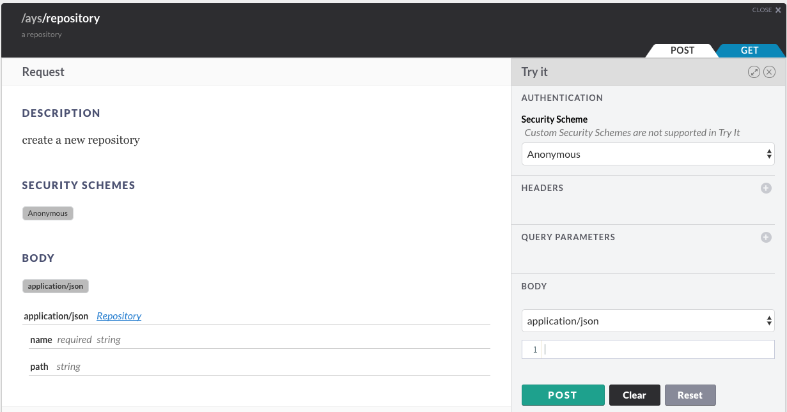

## How to create a new repository

You can create a repository in multiple ways:

- [In the Cockpit Portal](#portal)
- [Using the Cockpit API](#api)
- [At the CLI](#cli)


<a id="portal"></a>
### Using the Cockpit Portal

See the [Getting started with blueprints](../../Getting_started_with_blueprints/getting_started_with_blueprints.md) section.


<a id="api"></a>
### Using the Cockpit API

In order to use the Cockpit API you first need to obtain an JWT, as documented in the section about [how to get a JWT](../Get_JWT/Get_JWT.md).

Once you got the JWT:

```
curl -H "Authorization: bearer JWT"  /
     -H "Content-Type: application/json" /
     -d '{"name":"test-repo", "git_url": "https://github.com/user/reponame"}'
     http://BASE_URL/ays/repository
```

In the **API Console**:



For more information about the **API Console** go to the section about the [API Console](../../API_Console/API_Console.md).


<a id="cli"></a>
### At the CLI

@todo
