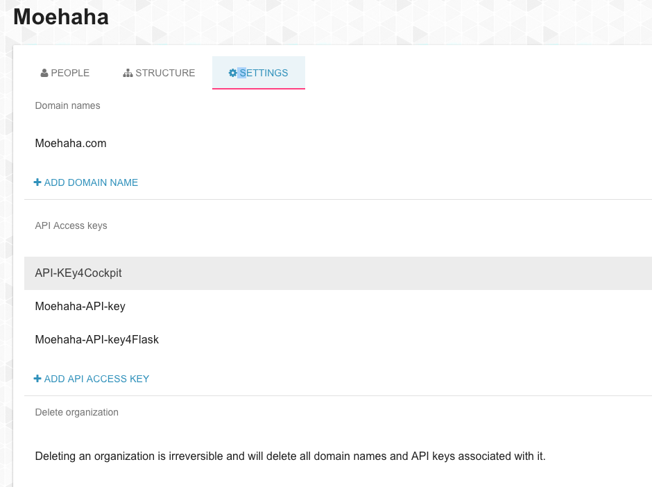
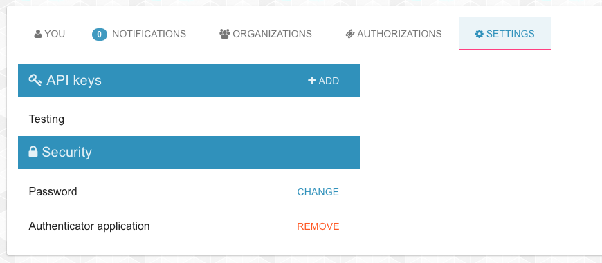

## How to get an OAuth Access Token

An OAuth access code is received from ItsYou.online after ItsYou.online could verify that your (client or server) application (code) was authorized to interact with ItsYou.online on behalf of a user or organization.

The application requests an OAuth access token by either using:

- the **Client Credentials Flow**, in which case your application will send just an API Key:

  - In case of interacting with the Cockpit on behalf of the organization for which the Cockpit was setup: the **Client id** of the organization + one of the **client secrets** managed under **API Access keys** on the **Settings** tab of the organization profile page on ItsYou.online:

    

  - In case of interacting with the Cockpit on behalf of a user (not recommended, rather go for the **Authorization Code Flow** instead, discussed here below): one of the API keys (**application_id** + **client secrets**), that you manage on the **Settings** tab of the user profile page on ItsYou.online user:

    

  This is what you will actually send - in both case:

  ```
  curl -d "grant_type=client_credentials&client_id=CLIENT_ID/APPLICATION_ID&client_secret=CLIENT_SECRET" /
       https://itsyou.online/v1/oauth/access_token
  ```

- or the **Authorization Code Flow**, in which case your application will first obtain an OAuth authorization code, and send this to ItsYou.online along with one of its own **Client id** (global_id) of the organization + one of the **client secrets** managed under **API Access keys** on the **Settings** tab of the organization profile page on ItsYou.online (see first screenshot here above)

  See the section about [how to get an OAuth authorization code](../Get_oauth_authorization_code/Get_oauth_authorization_code.md).

  This is what you will actually send:

  ```
  curl -d "client_id=CLIENT_ID&client_secret=CLIENT_SECRET&code=AUTHORIZATION_CODE&redirect_uri=CALLBACK_URL&state=STATE"
       https://itsyou.online/v1/oauth/access_token?
  ```

With the the received a OAuth access token, you can request a JWT needed for all Cockpit API, see the section about [how to get a JWT](../Get_JWT/Get_JWT.md).
