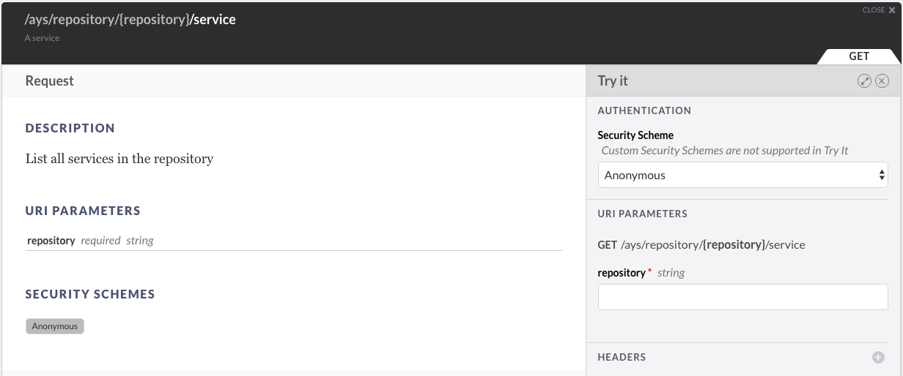

## How to list all service instances in a repository

You can list all service instance in multiple ways ways:

- [In the Cockpit Portal](#portal)
- [Using the Cockpit API](#api)
- [At the CLI](#cli)


<a id="portal"></a>
### Using the Cockpit Portal

See the [Getting started with blueprints](../../Getting_started_with_blueprints/Getting_started_with_blueprints.md) section.


<a id="api"></a>
### Using the Cockpit API

In order to use the Cockpit API you first need to obtain an JWT, as documented in the section about [how to get a JWT](../Get_JWT/Get_JWT.md).

Once you got the JWT, you can list all service instances for a specific repository using:

```
curl -H "Authorization: bearer JWT"  /
     -d "action=install&async=true&force=false&instance=INSTANCE-NAME&role=ROLE"
     https://BASE_URL/api/ays/repository/REPOSITORY-NAME/execute
```

In the **API Console**:



For more information about the **API Console** go to the section about the [API Console](../../API_Console/API_Console.md).


<a id="cli"></a>
### At the CLI

@todo
