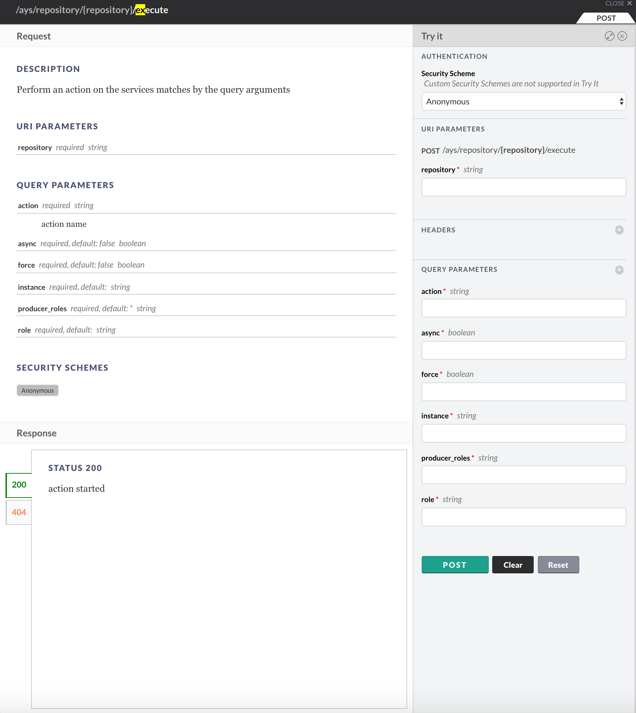

## How to uninstall a service

In the example used here we are uninstalling an **ovc_user** service instance, or in other words: uninstalling an OpenvCloud user.

Once a user got created through the Cockpit, as documented [here](../Add_user/Add_user.md), an AYS service instance will exist in the Cockpit. In order to delete the user, you need to all the **Uninstall** action.

> Note: Deleting an instance will not first call uninstall the action, see [how to delete a service instance](../Delete_service/Delete_service.md)

You have following options to call the **Uninstall** action:

- [Through the Cockpit portal](#portal)
- [Through the Cockpit APi](#api)

<a id="portal"></a>
## Execute the Uninstall action through the Cockpit Portal

Go to the **Repository Details** page of your repository, and select **Execute action** from the **Actions** dropdown:

[](!execute-action.png)

In the **Confirm Action Execute action** window specify **uninstall** as the action to execute, **Role** and **Instance** (name) of the instance, here **ovc_user** and **user1**:

[](!confirm-execute-action.png)


<a id="api"></a>
## Execute the Uninstall action using the Cockpit API

In order to use the Cockpit API you first need to obtain an JWT, as documented in the section about [how to get a JWT](../Get_JWT/Get_JWT.md).

Once you got the JWT, you can install a service instance:

```
curl -H "Authorization: bearer JWT"  /
     -d "action=uninstall&async=true&force=false%instance=INSTANCE-NAME&role=ROLE"
     https://BASE_URL/api/ays/repository/REPOSITORY-NAME/execute
```

So for instance to uninstall the user as described in the blueprint used in the sections [How to create a blueprint](../Create_blueprint/Create_blueprint.md), [How to execute a blueprint](../Execute_blueprint/Execute_blueprint.md) and [How to install a service](../Install_service/Install_service.md):

```
curl -H "Authorization: bearer JWT"  /
     -d "action=uninstall&async=true&force=false%instance=user1&role=ovc_user"
     https://BASE_URL/api/ays/repository/REPOSITORY-NAME/execute
```

> Note that uninstalling a services does not delete the service instance from the Cockpit. In order to delete a service from the Cockpit go to the section about [How to delete a service](../Delete_service/Delete_service.md).

In the **API Console**:



For more information about the **API Console** go to the section about the [API Console](../../API_Console/API_Console.md).
