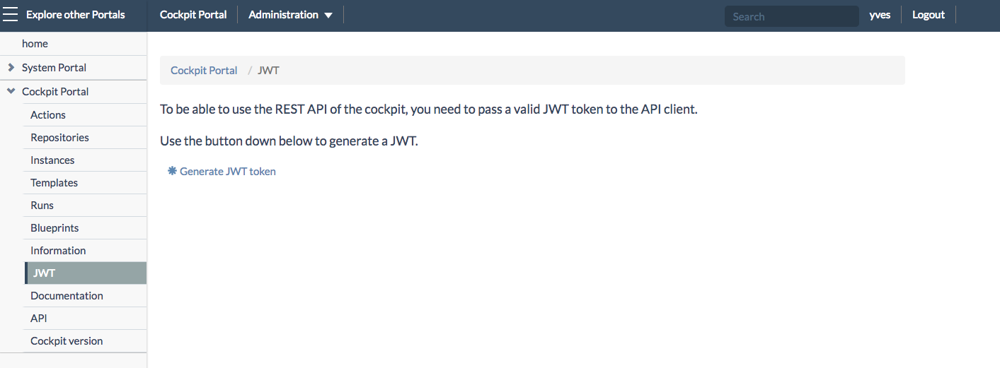
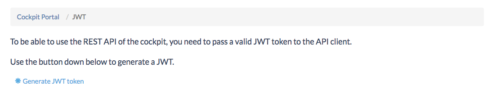
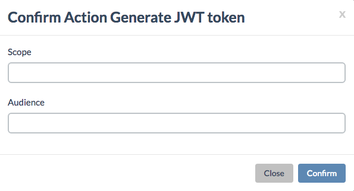
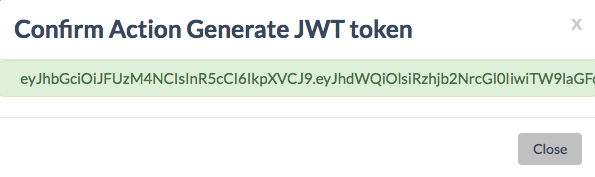

## Generating JWT Tokens

Clicking **JWT** in the left navigation menu of the **Cockpit Portal** brings you to a page where can quickly generate a JWT token:

The Cockpit Portal provides an easy way to generate such a JWT token:

- Go to the `/cockpit/jwt` page on the Cockpit Portal
- Click on **\*Generate JWT token**

The **Confirm Action Generate JWT token** window will popup:

Here you specify:
- **Scope**
- **Audience**

As a result you'll get the JWT token:

To copy the token double-click it (twice) in order to make sure you have fully selected the string.

You can quickly test the JWT token using the **API Console**, as documented [here](../API_Console/API_Console.md).
