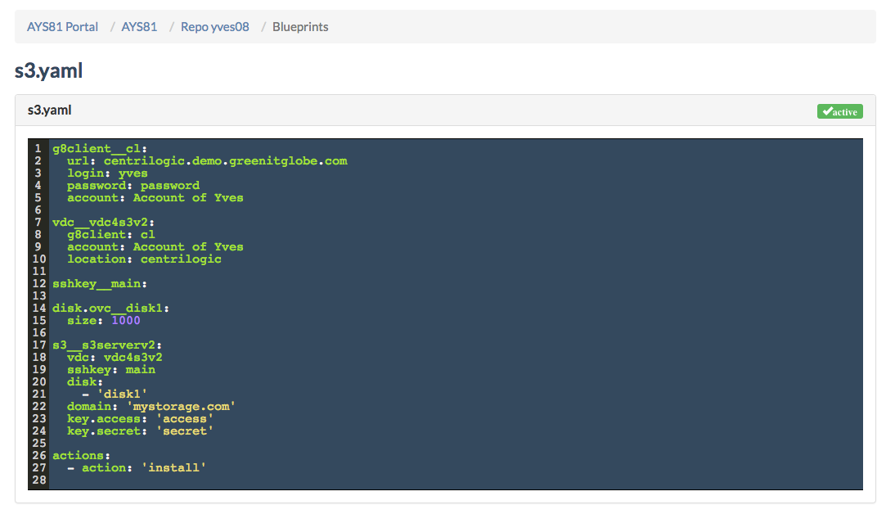

## Blueprints

On the **Blueprints** page you see all blueprints for a selected repository:

In order to add a blueprint, see [How to create a blueprint](../usage/Howto/Create_blueprint/Create_blueprint.md).
