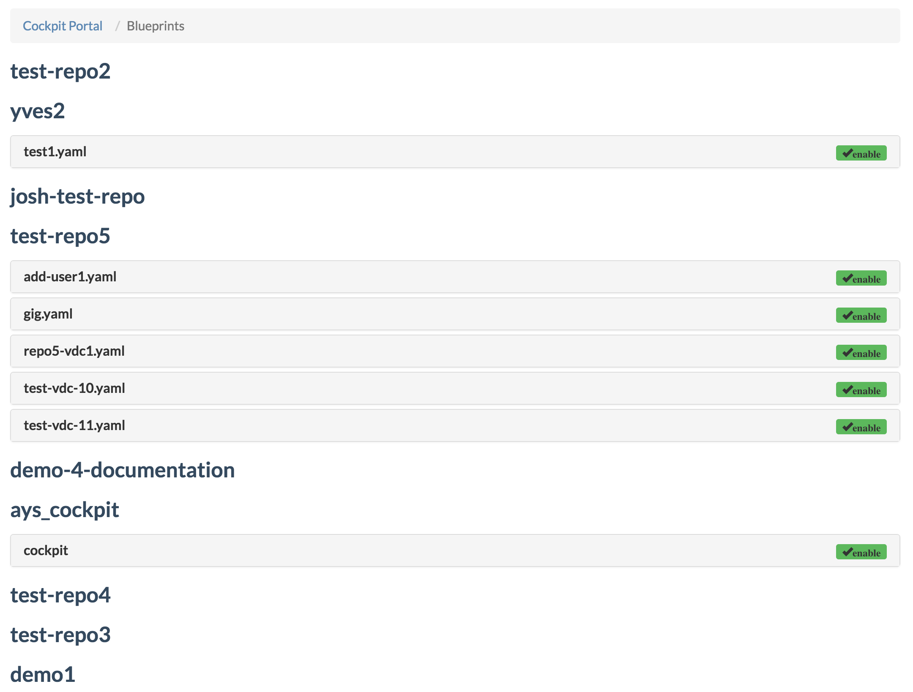
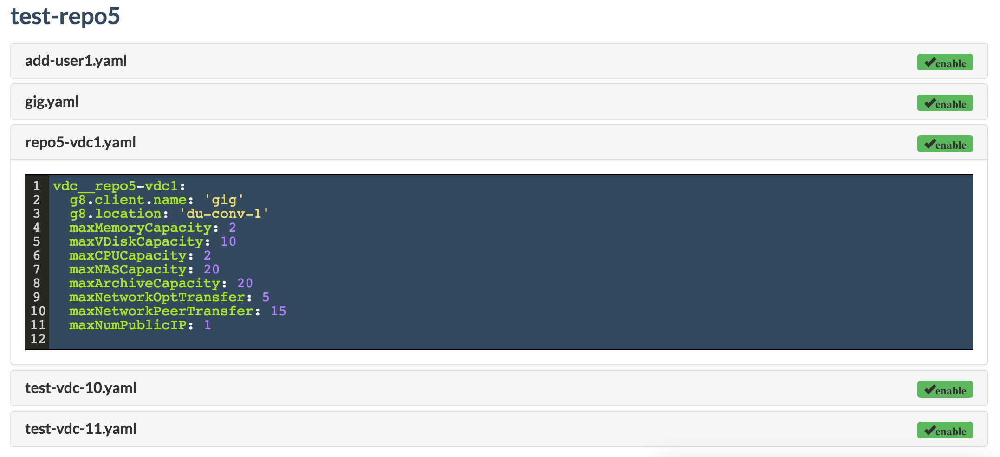

## Blueprints

On the **Blueprints** page you see all blueprints, of all repositories:

When you click on any of the blueprint names you'll see the actual blueprint content of that blueprint:

In order to add a blueprint, see [How to create a blueprint](../usages/Howto/Create_blueprint/Create_blueprint.md).
