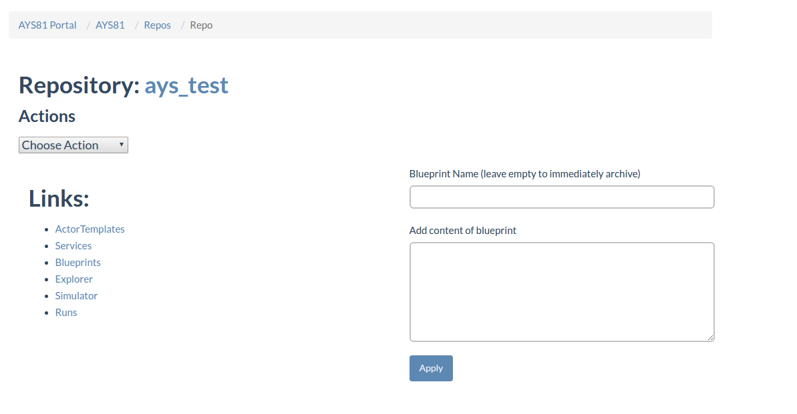
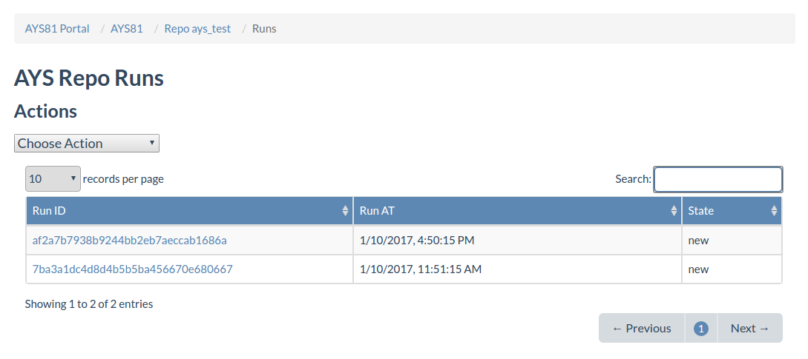
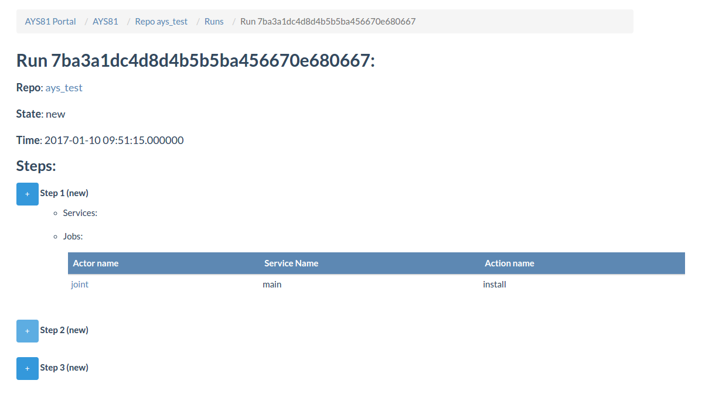
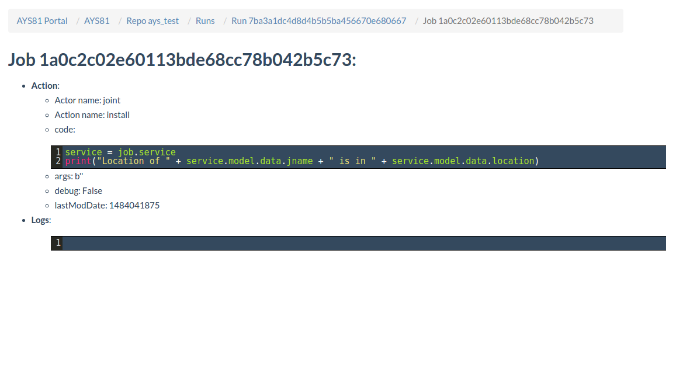

## Viewing runs using the Cockpit portal
In Repo details page you can select Runs in the Links menu to get an overview of all runs executed in this repository.



Here you can see a listing of all runs on this repository as as well as their time and their state.



Clicking the name ID of a run open run details, where the steps of this run are listed.
Each step of the run can be expanded, showing the actor name created in this run, service name and the action executed in this step.



By clicking on the actor name it is possible to examine the job details: the code of the executed function and the log file.



## Using the Cockpit API
In order to use the Cockpit API you first need to obtain an JWT, as documented in the section about [how to get a JWT.](https://github.com/Jumpscale/jscockpit/blob/8.1.1/docs/usage/Howto/Get_JWT/Get_JWT.md)
Using curl we can send a GET request to get a JSON object holding the run details.

You need to include the JWT in the request header.
```
curl -H "Authorization: bearer JWT"  /
     -H "Content-Type: application/json" /
     http://BASE_URL/ays/repository/REPO_NAME/aysrun/RUN_ID
```
