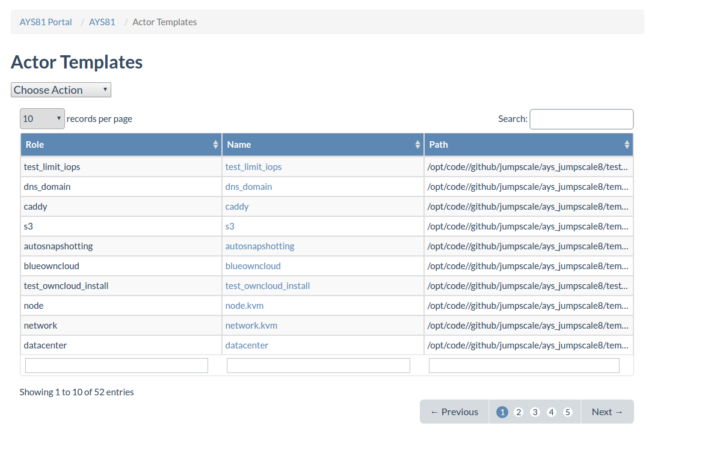
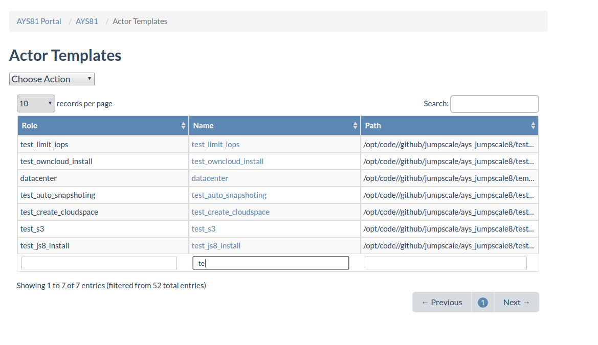
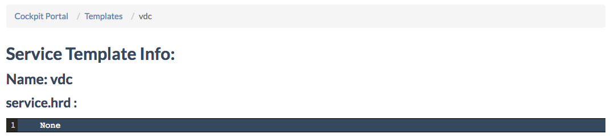
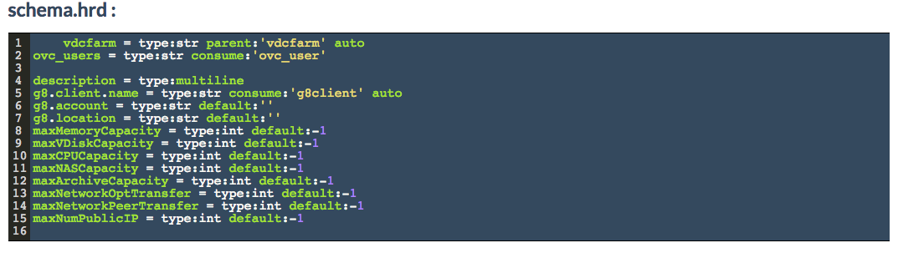
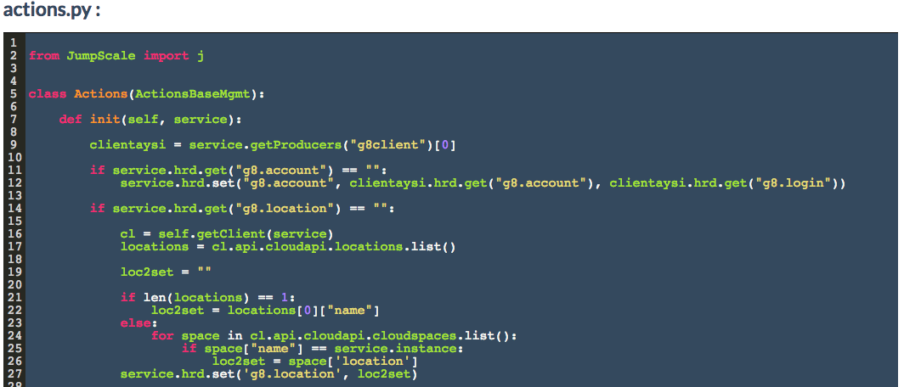
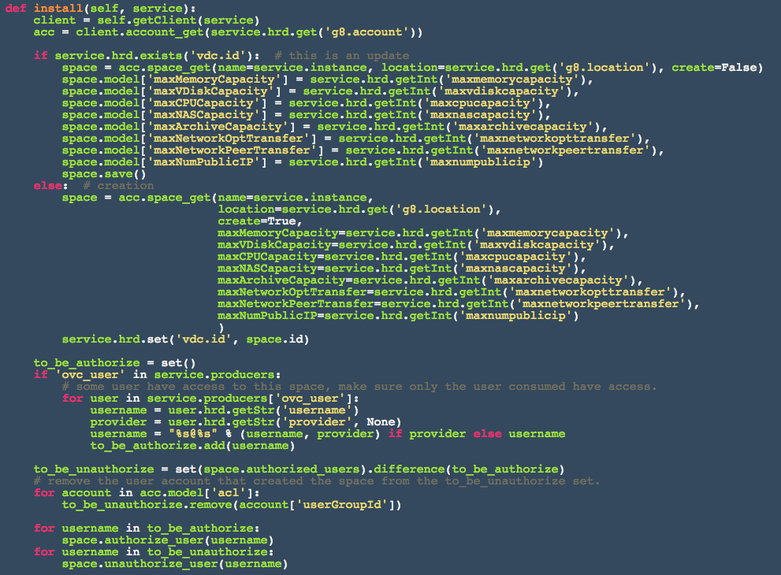
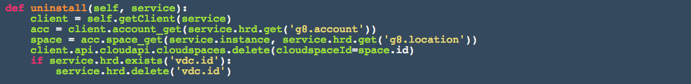

## Service Templates

In the **Templates** page you get an overview of all AYS service templates available in the Cockpit:

Here you can filter on the name of the **repository** where the template is available, or on the **name** of the service template:

Clicking the name of the service template leads you to the service **Template Details** page:

Under **schema.hrd** you see the attributes for describing a service instance of the service template type:

Under **actions.py** you see the implementation of all actions available for service instances of the service template type.

Here for the VDC service template for actions are implemented:

- init()
  

- install()
  

- uninstall()
  

- getClient()
  

  At the bottom of the page there is an overview of all service instances based on this service template:

  
