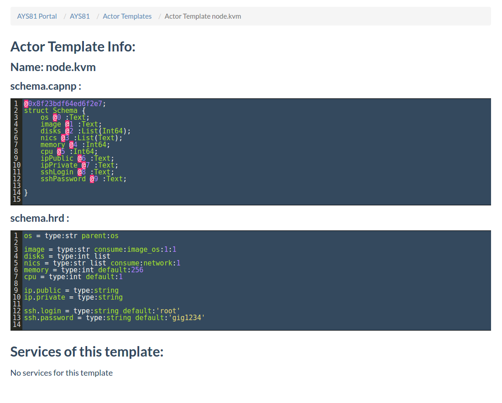

## Actor Templates
In the **Templates** page you get an overview of all AYS actor templates available in the Cockpit:

Here you can filter on the name of the **Role** , on the **name** of the actor template or based on its **path**:

Clicking the name of the actor template leads you to **Actor Template Info** page:

**schema.hrd** and **schema.capnp** describes a service instance of the actor template using different file formats.

At the bottom of the screen it is possible to examine the created services of this template.
